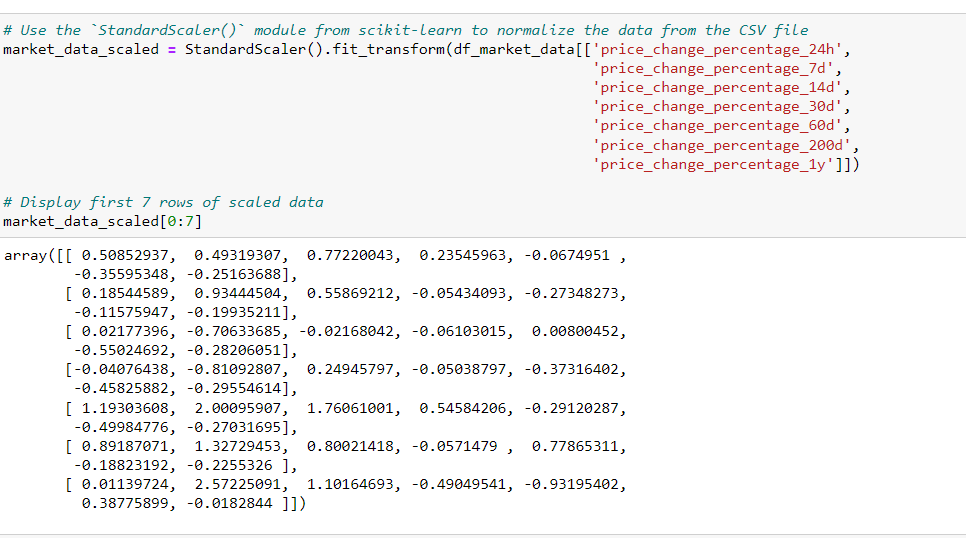

# CryptoClustering

I used my knowledge of Python and unsupervised learning to predict if cryptocurrencies are affected by 24-hour or 7-day price changes.

## Prepared the Data:

* I used the StandardScaler() module from scikit-learn to normalize the data from the CSV file.

* I created a DataFrame with the scaled data and set the "coin_id" index from the original DataFrame as the index for the new DataFrame.

# TO find the Best Value for k Using the Original Scaled DataFrame:

* I used the elbow method to find the best value for k using the following steps:
* Created a list with the number of k values from 1 to 11.
* Created an empty list to store the inertia values.
* Created a for loop to compute the inertia with each possible value of k.
* Created a dictionary with the data to plot the elbow curve.
* Plotted a line chart with all the inertia values computed with the different values of k to visually identify the optimal value for k.

* Answered the following question in my notebook: What is the best value for k?
Answer: 4

# Cluster Cryptocurrencies with K-means Using the Original Scaled Data:

* I used the following steps to cluster the cryptocurrencies for the best value for k on the original scaled data:
* Initialized the K-means model with the best value for k.
* Fit the K-means model using the original scaled DataFrame.
* Predicted the clusters to group the cryptocurrencies using the original scaled DataFrame.
* Created a copy of the original data and add a new column with the predicted clusters.
* Created a scatter plot using hvPlot as follows:
Set the x-axis as "PC1" and the y-axis as "PC2".
* Colored the graph points with the labels found using K-means.
* Added the "coin_id" column in the hover_cols parameter to identify the cryptocurrency represented by each data point.

# Optimized the  Clusters with Principal Component Analysis:

* I used the original scaled DataFrame, to perform a PCA and reduced the features to three principal components.
* I retrieved the explained variance to determine how much information can be attributed to each principal component
* Created a new DataFrame with the PCA data and set the "coin_id" index from the original DataFrame as the index for the new DataFrame.

# To find the Best Value for k Using the PCA Data:

* I used the elbow method on the PCA data to find the best value for k using the following steps:
* Created a list with the number of k-values from 1 to 11.
* Created an empty list to store the inertia values.
* Created a for loop to compute the inertia with each possible value of k.
* Created a dictionary with the data to plot the Elbow curve.
* Plotted a line chart with all the inertia values computed with the different values of k to visually identify the optimal value for k.

# Answered the following question in your notebook:

* What is the best value for k when using the PCA data?
* Does it differ from the best k value found using the original data?

# Cluster Cryptocurrencies with K-means Using the PCA Data:
* I used the following steps to cluster the cryptocurrencies for the best value for k on the PCA data:
* Initialized the K-means model with the best value for k.
* Fit the K-means model using the PCA data.
* Predicted the clusters to group the cryptocurrencies using the PCA data.
* Created a copy of the DataFrame with the PCA data and add a new column to store the predicted clusters.
* Created a scatter plot using hvPlot as follows:
* Set the x-axis as "price_change_percentage_24h" and the y-axis as "price_change_percentage_7d".
* Colored the graph points with the labels found using K-means.
* Added the "coin_id" column in the hover_cols parameter to identify the cryptocurrency represented by each data point.

# Answered the following question:
* What is the impact of using fewer features to cluster the data using K-Means?

Answer: The number of clusters (k) as shown in the elbow curve plots was not affected using fewer features. For cryptocurrency clusters, group 1 and 3 are very distinct from the rest of the cryptocurrencies, while group 0 and 2 are similiar. The use of fewer features to cluster data using K-means, helped reduce the amount of noise in the cryptocurrency clusters with pca, thereby making the grouping of the data more clear and readable.